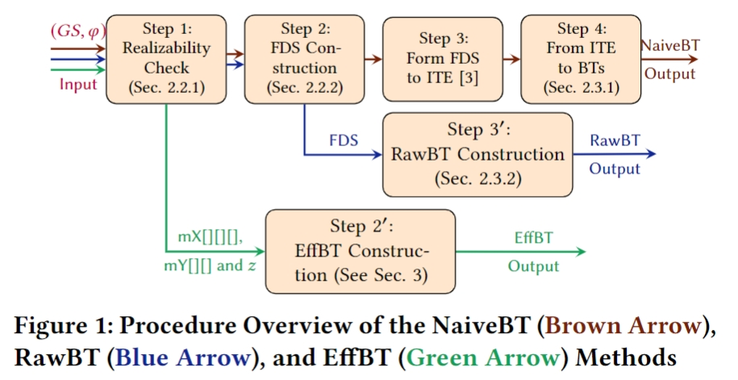

<head>
    
    
</head>

# **Introduction to EffBT**

There are two main categories in terms of reactive synthesis for BTs. The first, such as TAMP\cite{tamp-21}, utilizes a model-checking-based strategy on general LTL and suggests synthesizing BTs from an emptiness-checking procedure over product automata, which is the production of the Buchi automata (converted from LTL specifications) and a transition system (describes the robot and environment). If the specification is realizable, the procedure identifies a counter-example path (i.e., state transitions), and then constructs BTs from this path. Nevertheless, the conversion from LTL to Buchi automata exhibits exponential time complexity, implying that the running time increases exponentially with the size of the formula. Consequently, approaches relying on this strategy inherently face the challenge of high computational complexity (at least EXPTIME).

To reduce complexity, researchers propose obtaining BTs from F-LTL specifications rather than general LTL, forming the second strategy. In previous studies~\cite{mc-17}\cite{TADEWOS2022117022}, authors restrict formulas to LTL fragments and then obtain transition relations by calculating value functions, requirement functions, and constraint functions for each formula. Subsequently, they construct BTs from those functions. Our approach also embraces the second strategy but diverges significantly from previous efforts. Specifically, we calculate transition relations through a unified process, namely the realizability check of GR(1)~\cite{BLOEM2012911}, whereas earlier methods necessitate individual function calculations for each formula. Benefiting from this and the regularity of GR(1) formulas, we can modularly design BT structures and improve the execution efficiency of resulting BTs, such as adopting *Parallel* nodes, yet none of the earlier approaches have considered this aspect.

## **EffBT's Framework**

In our work, we propose EffBT, an efficient behavior tree synthesis and execution framework. Given the game structure $GS$ and GR(1) specifications $\varphi$ as input, EffBT generates an executable BT that satisfies predefined objectives, in which $GS$ encapsulates the dynamic properties of the system and environment while $\varphi$ describes their objects. Our framework comprises two primary procedures, Step~1 and Step~2$'$, as depicted in Fig.~\ref{fig: procedure overview}~(follows the \textcolor{ForestGreen}{\textbf{green arrow}}). In the first step, we check the realizability of given specifications and construct two intermediate arrays mX[][][] and mY[][], which are similar to the operations in~\cite{BLOEM2012911}. This checking process is formulated as a two-player game $(GS,\varphi)$ and then solved by $\mu$-calculus. Following this, Step~2$'$ employs a construction algorithm we propose to generate BTs from the computed mX[][][] and mY[][] arrays. Besides, we further refine the structure of subtrees and incorporate *Parallel* nodes based on the propositions in Sec.~\ref{sec: effbt}. This modification significantly enhances BT execution efficiency by reducing decision-making time.

 

 

The input of our method is the same as GR(1), which takes input as $(GS, \varphi)$.

<!-- The inputs of **CCMOP** are a program and the property to verify. **CCMOP** accepts the property and generates an AOP Declaration and Monitor code in C++. The AOP Declaration will be fed to Weaver, which weaves the monitor interface to the input program at the AST level. The instrumented AST will be passed to the compiler's backend and compiled into an object. The Monitor code will be compiled as a monitor binary with compilation option **-O3**. In the linking stage, the binaries mentioned above will be linked together to generate an executable with monitors. -->

# **Contacts**

Please feel free to contact us if you have any questions about **EffBT**.

*    Anonymous Temporarily (Under Review)

