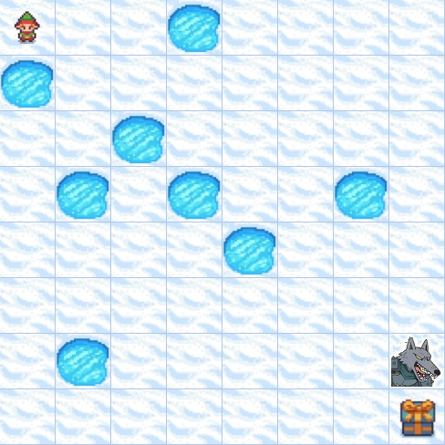
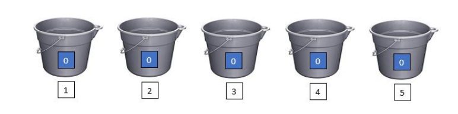

# Scenarios and Specifications
We demonstrate the specifications used in the experiment part of the Paper. Download all specifications in a zip file. [Download](resources/specifications.zip)

##  **1. The FrozenLake+ Scenario**

The following figure demonstrates the Frozen Lake game in Gymnasium \cite{towers_gymnasium_2023}. Initially, a player is located at the upper left corner (1,1) of a frozen lake grid world with a goal located at the far end of the world (e.g., the lower right corner (8,8) of the map). Several ice holes are distributed in the lake and the player needs to visit the goal while avoiding falling into them. Following that, we expand the initial settings to the FrozenLake+ (also denoted as Frozen$^+$) by adding a beast who chases the player continuously and moves half as fast as the player. In the beginning, the beast is located at a random position next to a random goal (in this figure, the beast is located at position (7,8) next to the only goal). Now, the player needs to visit all goals infinitely often while avoiding being caught and falling.
Various map sizes (including 8 $\times$ 8, 16 $\times$ 16, 24 $\times$ 24, and 32 $\times$ 32) of this scenario are generated, in which the occurrence probabilities of ice holes and goals are set to 0.125 and $\frac{1}{32}$ respectively during the generation.

 

 

* [FrozenLakePlus-8x8.spectra](resources/spec-frozen/FrozenLakePlus-8x8.spectra)
* [FrozenLakePlus-16x16.spectra](resources/spec-frozen/FrozenLakePlus-16x16.spectra)
* [FrozenLakePlus-24x24.spectra](resources/spec-frozen/FrozenLakePlus-24x24.spectra)
* [FrozenLakePlus-32x32.spectra](resources/spec-frozen/FrozenLakePlus-32x32.spectra)
* [FrozenLakePlus-64x64.spectra](resources/spec-frozen/FrozenLakePlus-64x64.spectra)

##  **2. The Cinderella Scenario**

In this scenario, Cinderella battles with her stepmother to maintain the safety of a water bucket system, which has $N$ water buckets arranged in a circle, and each has a maximum capacity of $B$ water units. At the start, all buckets are empty. In each turn, the stepmother pours $A$ units of water into the buckets of her choice, and Cinderella empties $C$ adjacent buckets. The objective of Cinderella is to maintain the emptiness of all buckets.
Specifications in Spectra Language are from \cite{cinderella}.
For this scenario, we fix two variables: $A=5$ and $C=2$. This means that the stepmother can pour up to five units of water into buckets during her turn and then Cinderella empties two adjacent buckets. Subsequently, we establish four different configurations of this scenario with predefined numbers of bucket and capacity, denoted as set $(N, B)\in$ \{(6,12), (7,14), (8,16), (9,18)\}.

* [Cinderella-Stepmother-5-10.spectra](resources/spec-cinderella/cinderella-5x10.spectra)
* [Cinderella-Stepmother-6-12.spectra](resources/spec-cinderella/cinderella-6x12.spectra)
* [Cinderella-Stepmother-7-14.spectra](resources/spec-cinderella/cinderella-7x14.spectra)
* [Cinderella-Stepmother-8-16.spectra](resources/spec-cinderella/cinderella-8x16.spectra)
* [Cinderella-Stepmother-9-18.spectra](resources/spec-cinderella/cinderella-9x18.spectra)

##  **3. The SYNTECH Scenario**

We also examine our methods on various tasks and scenarios from [*SYNTECH*](https://smlab.cs.tau.ac.il/syntech/spectra/index.html), including ConvoyCar, RobotArm, Humanoid Robot, Self-Parking Smart Cars, Job Scheduler, and Tower of Hanoi. 
The number of disks in Hanoi is twelve.

* [Tower of Hanoi](resources/spec-syntech/Hanoi.spectra)
* [Convoy Car](resources/spec-syntech/ConvoyCar.spectra)
* [Humanoid Robot](resources/spec-syntech/Humanoid.spectra)
* [Job Scheduler](resources/spec-syntech/JobScheduler.spectra)
* [Robot Arm](resources/spec-syntech/roboticarm.spectra)
* [Self-Parking Smart Car](resources\spec-syntech\SelfParkingSmartCar.spectra)