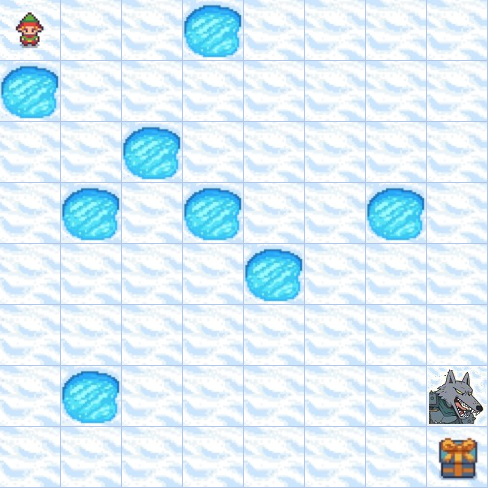

# Scenarios and Specifications
We demonstrate the specifications used in the experiment part of the Paper.

##  **1. The FrozenLake+ Scenario**

 

 

* [FrozenLakePlus-8x8.spectra](resources/spec-frozen/FrozenLakePlus-8x8.spectra)
* [FrozenLakePlus-16x16.spectra](resources/spec-frozen/FrozenLakePlus-16x16.spectra)
* [FrozenLakePlus-24x24.spectra](resources/spec-frozen/FrozenLakePlus-24x24.spectra)
* [FrozenLakePlus-32x32.spectra](resources/spec-frozen/FrozenLakePlus-32x32.spectra)
* [FrozenLakePlus-64x64.spectra](resources/spec-frozen/FrozenLakePlus-64x64.spectra)

##  **2. The Cinderella-Stepmother Scenario**

* [Cinderella-Stepmother-5-10.spectra](resources/spec-cinderella/cinderella-5x10.spectra)
* [Cinderella-Stepmother-6-12.spectra](resources/spec-cinderella/cinderella-6x12.spectra)
* [Cinderella-Stepmother-7-14.spectra](resources/spec-cinderella/cinderella-7x14.spectra)
* [Cinderella-Stepmother-8-16.spectra](resources/spec-cinderella/cinderella-8x16.spectra)
* [Cinderella-Stepmother-9-18.spectra](resources/spec-cinderella/cinderella-9x18.spectra)

* * *

Download all specifications in a zip file. [Download](resources/specifications.zip)